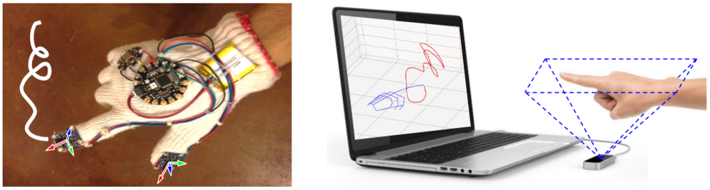
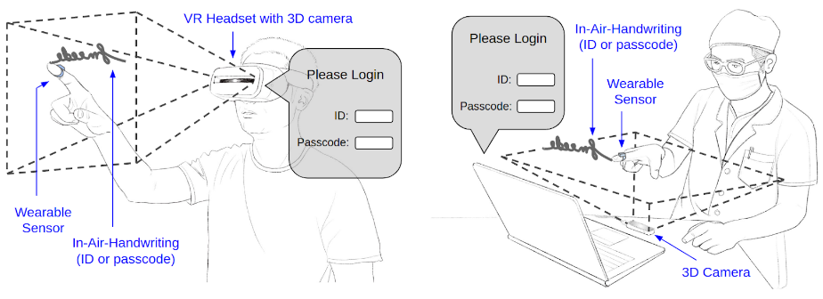

# FMKit - A Finger Motion Analysis Library and Data Repository

FMKit is a library and data repository for finger motion based user login and in-air-handwriting analysis.

## The FMKit Library

The FMKit library contains a set of Python code and scripts to model and process in-air-handwriting signals.

## The Data Repository

Here is a description of the dataset we have collected to facilitate our research on in-air-handwriting passcode and biometrics. Two devices are used (shown in the following figure): a wearable device (a custom-made data glove with inertial sensors) and a contactless 3D camera (the Leap Motion controller). The data repository contains the following five parts.

(1) Sign-up and Sign-in: We asked each participating user to create two distinct meaningful strings and write them in-the-air, one as an account ID and the other as an account passcode. Such a string may include alphanumeric letters, characters in a language other than English, or meaningful symbols such as five-pointed stars. The requirements of the account ID and the account passcode are the same. Hence, each string can be used as either an ID or a passcode. For each string, we asked the user to write it 5 repetitions as registration and another 5 repetitions as login attempts. This simulates the normal sign-up and sign-in procedure (shown in the following figure). In total 129 users participated the data collection and 258 strings are obtained. 

(2) Spoofing with Semantic Leakage: We asked 10 skilled imposters to imitate the in-air-handwriting of the ID and password generated by the users in the first dataset. In this setting, the imposters know the semantic meaning of the strings written by the legitimate users, but the imposters have not seen the legitimate users writing the ID and password in the air, which simulates spoofing attack with semantic leakage. All strings in the first dataset are spoofed and each imposter wrote every string with 5 repetitions using both two devices for data collection. In total, there are 258 * 10 * 5 * 2 = 25,800 data samples.

(3) Spoofing with both Semantic and Visual Leakage: We asked 10 skilled imposters to imitate the in-air-handwriting of the ID and password generated by the users in the first dataset.
In this setting, the imposters can watch the recorded video of the in-air-handwriting and they will be informed with the semantic meaning of the in-air-handwriting. 132 strings in the first dataset are spoofed and each imposter wrote the string with 5 repetitions using both two devices for data collection. In total, there are 132 * 10 * 5 * 2 = 13,200 data samples.

(4) Long-Term Persistence Study: We kept collecting the sign-in in-air-handwriting of a subset of the users in the first dataset for a period of about 4 weeks, which simulates login activity in the long term. Similar to the procedure in the first dataset, the user wrote each string 5 repetitions as registration. After that, the users wrote the strings for the account ID and the account passcode 5 repetitions in a single day as a session, and at least 2 sessions each week, in total 10 sessions at least. 22 users participated this dataset and in total there are 44 * 5 * 2 + 44 * 10 * 5 * 2 = 4,840 data samples.

(2) Spoofing with Semantic Leakage: We asked 10 users to write 210 English words and 210 Chinese words with 5 repetitions for each word with both devices. In total, there are 2 * 210 * 10 * 5 * 2 = 42,000 data samples.

(6) Usability Survey: We asked the participating users to fill a survey on the usability of gesture sign-in system with various sensors and different types of gestures. 72 users responded to the survey.

## Authors

* **Duo Lu <duolu@asu.edu>** - main contributor, current maintainer of the project.
* **Yuli Deng <ydeng19@asu.edu>** - contributor.

## Papers

* Duo Lu, Dijiang Huang, "FMCode: A 3D In-the-Air Finger Motion Based User Login Framework for Gesture Interface." *arXiv preprint arXiv:1808.00130, 2018.*
* Duo Lu, Dijiang Huang, "FMHash: Deep Hashing of In-Air-Handwriting for User Identification." *arXiv preprint arXiv:1806.03574, 2018.*
* Duo Lu, Dijiang Huang, Yuli Deng, and Adel Alshamrani. "Multifactor user authentication with in-air-handwriting and hand geometry." *In 2018 International Conference on Biometrics (ICB), 2018.*
* Duo Lu, Kai Xu, and Dijiang Huang, "A Data Driven In-Air-Handwriting Biometric Authentication System", *in Proceedings of the International Joint Conference on Biometrics (IJCB), 2017.*

## License

This project is licensed under the MIT License - see the [LICENSE.md](LICENSE.md) file for details

## Acknowledgments

We would like to thank all participants and volunteers who helped us collecting the data.
