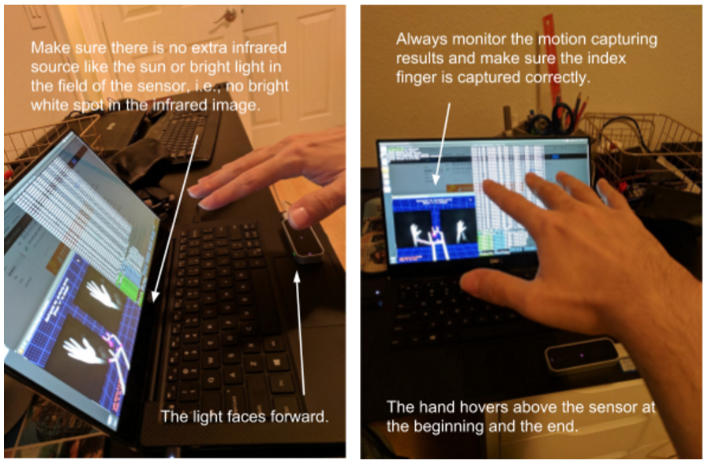

# FMKit - A Library and Data Repository for In-Air-Handwriting Analysis

FMKit is a library and data repository for finger motion based user login and in-air-handwriting analysis. We have also built a demo system based on them. See the demo [here](https://youtu.be/O3Jqq9yqJSE) and [here](https://www.youtube.com/watch?v=asxqpF7dH10).

## The FMKit Library

The FMKit library contains a set of Python code and scripts to model and process in-air-handwriting signals. See the "code" folder. An overview is shown as follows.

* code_core ---> The main library code. 
  * The "fmsignal" module contains the classes modeling the finger motion signal. 
  * The "fmvis" module contains functions to plot and animate the signal and the trajectory.
  * The "fmutils" module contains common utility code.
  * The "pyrotation" and "pyrotation_demo" are copied from the [pyrotation](https://github.com/duolu/pyrotation) project, which is necessary for finger motion signal preprocessing.
* code_cutils ---> Utility code written in C to speed up the Dynamic Time Warping calculation.
* data_example ---> Some example in-air-handwriting signals, collected using two devices.

## The Data Repository

Here is a description of the dataset we have collected to facilitate our research on in-air-handwriting. We have IRB approval of this data collection (Arizona State University STUDY00008279 and STUDY00010539). If you would like to use the data in your research, please send us an email (see the "authors" section below).

Two devices are used (shown in the following figure): a wearable device (a custom-made data glove with inertial sensors) and a contactless 3D camera (the Leap Motion controller). The data repository contains the following five datasets.

**(1) Sign-up and Sign-in**: We asked each participating user to create two distinct meaningful strings and write them in-the-air, one as an account ID and the other as an account passcode. Such a string may include alphanumeric letters, characters in a language other than English, or meaningful symbols such as five-pointed stars. The content of the string is determined by the user. Hence, each string can be used as either an ID or a passcode. For each string, we asked the user to write it 5 repetitions as registration and another 5 repetitions as login attempts. This simulates the normal sign-up and sign-in procedure (shown in the following figure). In total 180 users participated the data collection and 360 strings are obtained. In total, there are 360 (strings) * 10 (repetitions) * 2 (devices) = 7,200 signals.

**(2) Spoofing with Semantic Leakage**: We asked 10 skilled imposters to imitate the in-air-handwriting of the ID and password generated by the users in the first dataset. In this setting, the imposters know the semantic meaning of the strings written by the legitimate users, but the imposters have not seen the legitimate users writing the ID and password in the air, which simulates spoofing attack with semantic leakage. All strings in the first dataset are spoofed and each imposter wrote every string with 5 repetitions using both two devices for data collection. In total, there are 360 (strings) * 10 (imposters) * 5 (repetitions) * 2 (devices) = 36,000 signals.

**(3) Spoofing with both Semantic and Visual Leakage**: We asked 10 skilled imposters to imitate the in-air-handwriting of the ID and password generated by the users in the first dataset. In this setting, the imposters can watch the recorded video of the in-air-handwriting and they will be informed with the semantic meaning of the in-air-handwriting. 180 strings in the first dataset are spoofed and each imposter wrote the string with 5 repetitions using both two devices for data collection. In total, there are 360 (strings) * 10 (imposters) * 5 (repetitions) * 2 (devices) = 18,000 signals.

**(4) Long-Term Persistence Study**: We kept collecting the sign-in in-air-handwriting of a subset of the users in the first dataset for a period of about 4 weeks, which simulates login activity in the long term. In the first dataset, the user wrote each string 5 repetitions as registration. In this dataset, the users wrote the strings for the account ID and the account passcode 5 repetitions consecutively as a session, and 10 sessions in total. 40 users participated in this dataset. In total there are 80 (strings) * 10 (imposters) * 5 (repetitions) * 2 (devices) = 8,000 data samples.

**(5) In-Air-Handwriting Words**: We asked 10 users to write 210 English words and 210 Chinese words with 5 repetitions for each word with both devices. In total, there are 2 (languages) * 210 (strings) * 10 (writers) * 5 (repetitions) * 2 (devices) = 42,000 data samples.

**(6) Usability Survey**: We asked the participating users to fill a survey on the usability of gesture sign-in system with various sensors and different types of gestures. 72 users responded to the survey.

## Data Collection Procedures

Here is the detailed procedure for the Leap Motion controller. The data collection is done on several identical Linux desktop and laptop machines. On each machine, three Linux console terminals should be opened, one for the Leap Motion daemon process (typing "sudo leapd"), one for the Leap Motion control panel (typing "LeapControlPanel"), and the last for the actual data collection program (typing "python ./sensor_leap.py xxx.txt" or launch the client with a GUI). At the beginning of writing each string, the participant should hover the hand above the sensor, like that in the following figure. Once the data collection starts, i.e., immediately after the "sensor_leap.py" script executes or the "start/stop" button is clicked, the hand should start to move. At the end of writing, the hand should restore to the initial position. The data collection program can be stopped by the user (press the "space" key or clicking the "start/stop" button), or it can automatically stop if the user's hand stops moving for roughly 0.8 seconds. The participant can write from left to right or just write every letter at the same place. The user is not required to write in a legible way.

The procedure for the data glove is similar. Only one Linux console terminal is needed for the actual data collection program. Different from the Leap Motion controller where the user must write within the field of view of the sensor, the data glove does not have such a constraints. The user can just start moving after the data collection program starts to collect data. When the user finishes writing, the data collection program can be stopped in the same way as that for the Leap Motion controller.

The captured handwriting signal is individually named. For the ID string, it is "id_id_xx.txt", where "xx" the sequence number of the repetition. For example, if the ID string is "duolu", the file is named as "duolu_duolu_01.txt" for the first repetition. For the passcode, similarly, it is "id_passcode_xx.txt". For example, if the ID string is "duolu" and the passcode is "fmcode", the file name is "duolu_fmcode_01.txt". In this way, we can immediately know which user writes what content from the file name while debugging code and tuning trained models. If the user choose to write in Chinese, pinyin is used in the file name to indicate the content.

For the spoofing dataset, the procedure of spoofing with semantic leakage is similar to that in sign-up and sign-in, but with only 5 repetitions for each string. The file name is in the format of "spoofer_string_xx.txt". For example, if the participant is designated to be "spoofer08", and the spoofed string is "fmcode", the file name is "spoofer08_fmcode_01.txt" for the first repetition. For the spoofing with both semantic and visual leakage dataset, the procedure and file name convention are the same.

For the long-term persistance study dataset, the procedure and file name convention are the same as sign-up and sign-in. However, the sequence number of repetitions will linearly increase. For example, if the ID string is "duolu" and the passcode is "fmcode", for the registration, the file name will be "duolu_fmcode_01.txt" to "duolu_fmcode_05.txt". For the first login session, the file names will be "duolu_fmcode_06.txt" to "duolu_fmcode_10.txt". Similarly, for the second login session, the file names will be increased to "duolu_fmcode_11.txt" to "duolu_fmcode_15.txt", and so on.

For the in-air-handwriting words dataset, the procedure and file name convention are the same as spoofing with semantic leakage. Instead of using "spoofer", "user" is used in the file name. For example, if the participant is designated as "user08", and it writes the English words "agree", for the first repetition, the file name would be "user08_agree_01.txt". For Chinese words, pinyin is used in the file name.

## Data Format

The finger motion signal (i.e., instances of the "FMSignal" class) is time series containing samples of physical states of the fingers obtained from a user writing some string in a certain language in the air. It is also commonly called in-air-handwriting or just handwriting for short. Typically only the tip of the index finger is considered, and the physical states contains position, angular pose, speed, angular speed, linear acceleration, and angular acceleration. 

The time series is denoted as s = ( s1, s2, ..., sl ), and each si = ( si1, si2, ..., sid ), where l is the number of samples and d is the sensor dimension. Typically the samples are generated at a constant rate and each sample si is associated with a timestamp tsi. A signal can have a user label u and a content label v, denoting the user who generates this signal and the content. These two labels are typically strings. For spoofing attack signals, they have the same content label as the attacked signals but different user labels. All signals with the same user label and content label forms a set S = { s(1), s(2), ..., s(k) }. In a set, each signal has a sequence id k, denoting the index of the signal in the dataset. For signals in the long-term persistence study, each signal has an additional session label w, denoting which session it is obtained. The session label is always an integer. If the session label is 0, it means that the signals is obtained in the same session as registration. A set S may be partitioned into multiple sessions. However, the sequence id is unique for each signal in the set regardless of sessions.

Since a set of signals S is obtained from the same user writing the same content, they have the same user label and content label if used in identification or recognition tasks. A template t can be generated by aligning all signals in S to the first signal and summing them up. In this way, the template has exact same format as an ordinary signal. The aligning process is typically done through Dynamic Time Warping (DTW), which is also widely used for signal comparison and authentication task.

A signal s is usually stored as a matrix with l rows and d + 1 columns, where the first column is the timestamp tsi, and each row in the remaining columns corresponds to si.

## Authors

* **Duo Lu < duolu AT asu DOT edu >** - main contributor, current maintainer of the project.
* **Yuli Deng < ydeng19 AT asu DOT edu >** - contributor.
* **Linzhen Luo < lluo21 AT asu DOT edu >** - contributor.
* **Dijiang Huang < dijiang.huang AT asu DOT edu >** - our academic advisor and sponsor.

## Papers

* Duo Lu, Linzhen Luo, Dijiang Huang, Yezhou Yang, "**FMKit: An In-Air-Handwriting Analysis Library and Data Repository.**" *CVPR Workshop on Computer Vision for Augmented and Virtual Reality, 2020.* [[pdf]](/papers/fmkit.pdf) [[link]](https://mixedreality.cs.cornell.edu/workshop/2020/papers#block-93cead2afaf5f6895a67) [[video]](https://youtu.be/O3Jqq9yqJSE)
* Duo Lu, Dijiang Huang, "**FMCode: A 3D In-the-Air Finger Motion Based User Login Framework for Gesture Interface.**" *arXiv preprint arXiv:1808.00130, 2018.* [[pdf]](/papers/fmcode.pdf) [[link]](https://arxiv.org/abs/1808.00130)
* Duo Lu, Dijiang Huang, "**FMHash: Deep Hashing of In-Air-Handwriting for User Identification.**" *in Proceedings of the International Conference on Communication (ICC), 2019* [[pdf]](/papers/fmhash.pdf) [[link]](https://arxiv.org/abs/1806.03574) [[slides]](/papers/fmhash_slides.pdf) [[video]](https://www.youtube.com/watch?v=MyaWe7RX8oE)
* Duo Lu, Dijiang Huang, Yuli Deng, and Adel Alshamrani. "**Multifactor user authentication with in-air-handwriting and hand geometry.**" *In 2018 International Conference on Biometrics (ICB), 2018.* [[pdf]](/papers/multifactor.pdf) [[link]](https://ieeexplore.ieee.org/document/8411230) [[slides]](/papers/multifactor_slides.pdf) [[poster]](/papers/multifactor_poster.pdf)
* Duo Lu, Kai Xu, and Dijiang Huang, "**A Data Driven In-Air-Handwriting Biometric Authentication System.**", *in Proceedings of the International Joint Conference on Biometrics (IJCB), 2017.* [[pdf]](/papers/data-driven.pdf) [[link]](https://ieeexplore.ieee.org/document/8272739) [[slides]](/papers/data-driven_slides.pdf)

## License

This project is licensed under the MIT License - see the [LICENSE.md](LICENSE.md) file for details

## Acknowledgments

We would like to thank all participants and volunteers who helped us collecting the data.

This project is supported by NSF CCRI award [#1925709](https://www.nsf.gov/awardsearch/showAward?AWD_ID=1925709).
